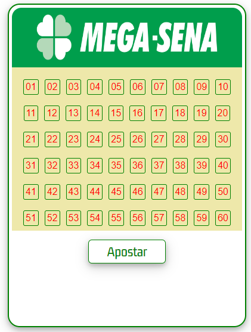
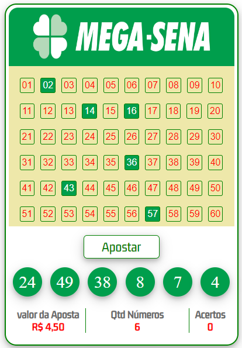

##  Simulador de Loteria Mega-Sena
 

  </img>
  </img>

 

 

  

### Tecnologias utilizadas:

 

  
  
  

 

### Visualização do projeto: 

- [Simulador de Loteria Mega-Sena](https://alarme-em-js.netlify.app/)
